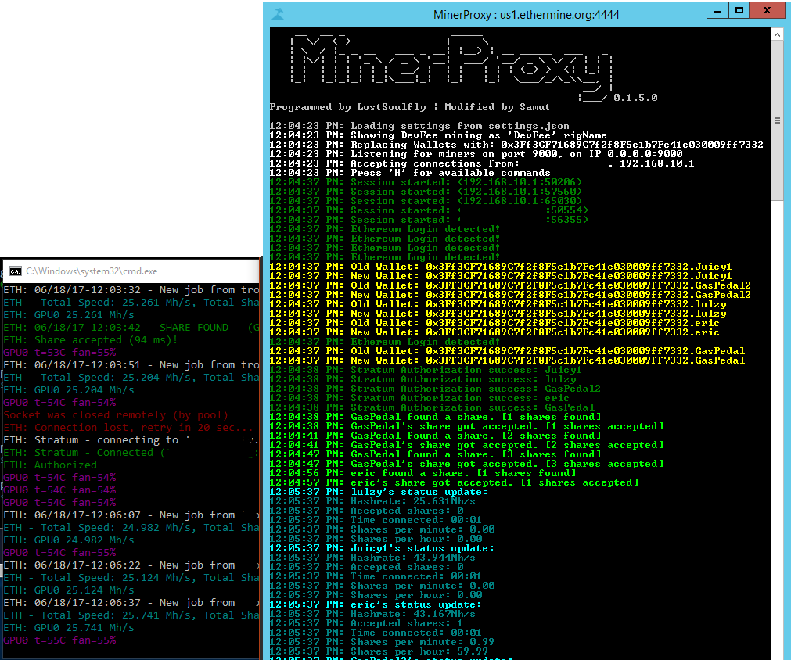

# MinerProxy

Original proxy from https://github.com/RajanGrewal -- I've simply modified it to suit my needs.

I wanted a proxy that I could direct my miners to that would allow me to see their status easily, including submitted/accepted shares and reported hashrates.
I also wanted it to replace the wallet that is sent to the pool with my own, while maintaining the miner's original name.

Confirmed working on Alpereum and Ethermine.

    Setting <Identify DevFee> will modify the DevFee's rigName to 'DevFee' when reported to pool. Even if you don't set it to 'True', the DevFee wallet will be replaced.
    <Allowed IP> can be IP or 0.0.0.0 to allow all connections.
    
    MinerProxy.exe <local port> <remote host> <remote port> <Allowed IP> <Your Wallet Address> <Identify DevFee> <Log to file> <debug>
    MinerProxy.exe 9000 us1.ethermine.org 4444 127.0.0.1 0x3Ff3CF71689C7f2f8F5c1b7Fc41e030009ff7332 True False False

Most debug output is disabled currently, even when enabled.

## Stale shares
If you run the Proxy on your local network, Claymore will display this error:

    Miner detected that you use local pool or local stratum proxy.
    This mode is not currently supported and will cause more stale shares.

I'm not sure how to resolve this, other than running the proxy from a remote computer.
My mining rigs are off-site, so I'm run the proxy from home.
Whether this will actually cause stale shares, I don't know. There's a lot of suspicion behind Claymore and its handling of Stale shares, but I'm open to speculation.

## Todo
- [x] Log traffic to file
- [x] Deserialize/Serialize JSON objects
- [x] Replace all wallets with your own
- [x] Only accept from specific IP (or all)
- [x] Calculate and display hashrate (debug must be on)
- [ ] Verify support for other pools (nanopool, mininghub, etc)
- [ ] Verify support for other Ethash coins (Expanse, Ubiq, etc)
- [ ] Support other non-Ethash coins (ZEC, CryptoNote, etc)
- [ ] Allow connect from list of IPs or IP subnet
- [ ] Stats via built in server/Possibly REST API
- [ ] Auto failover if server stops accepting shares/no getWork replies
- [ ] Save/load settings from JSON file
- [ ] Verbose mode/Multiple debug levels
- [ ] Understand full Stratum protocol

### Help
I realize this code probably looks pretty horrible. I'm still quite new to C#, so if you have any recommendations or improvements, please submit a PR and hopefully I can learn from it!
